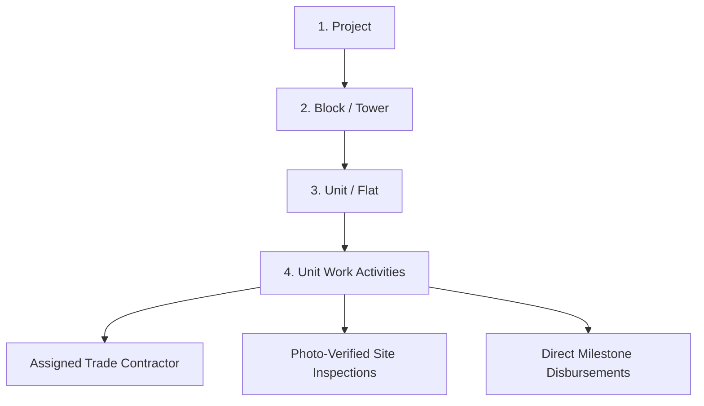
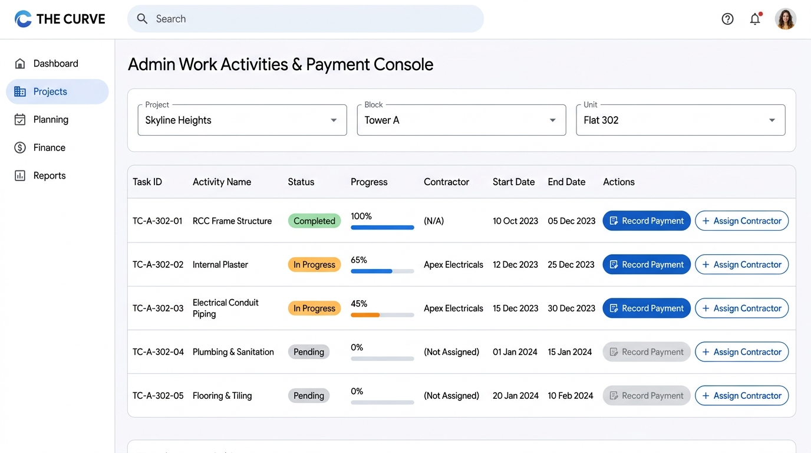
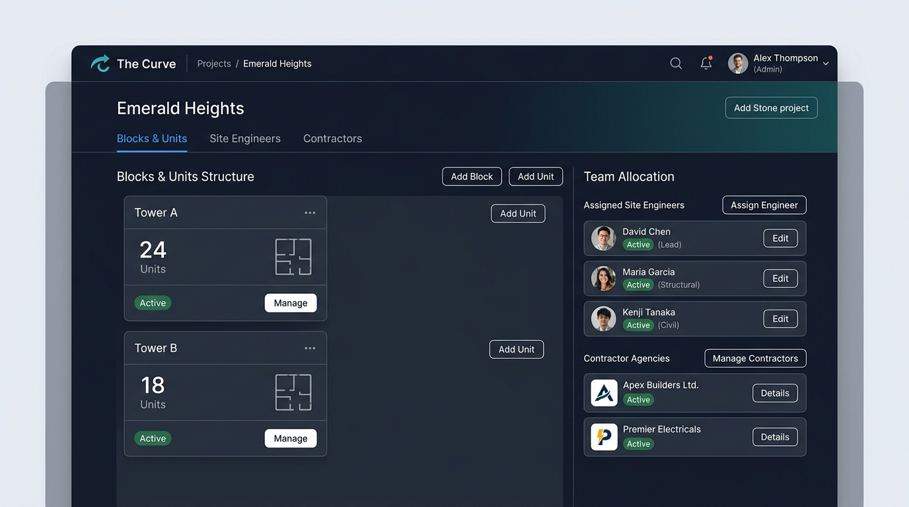
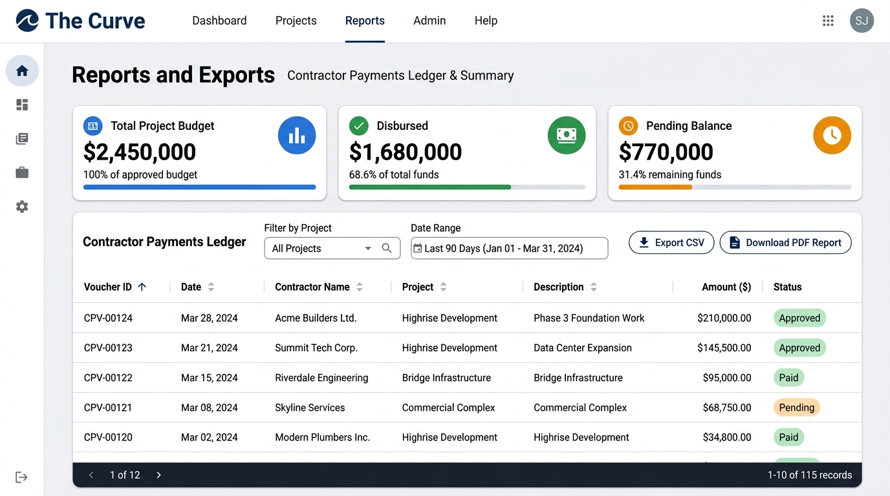
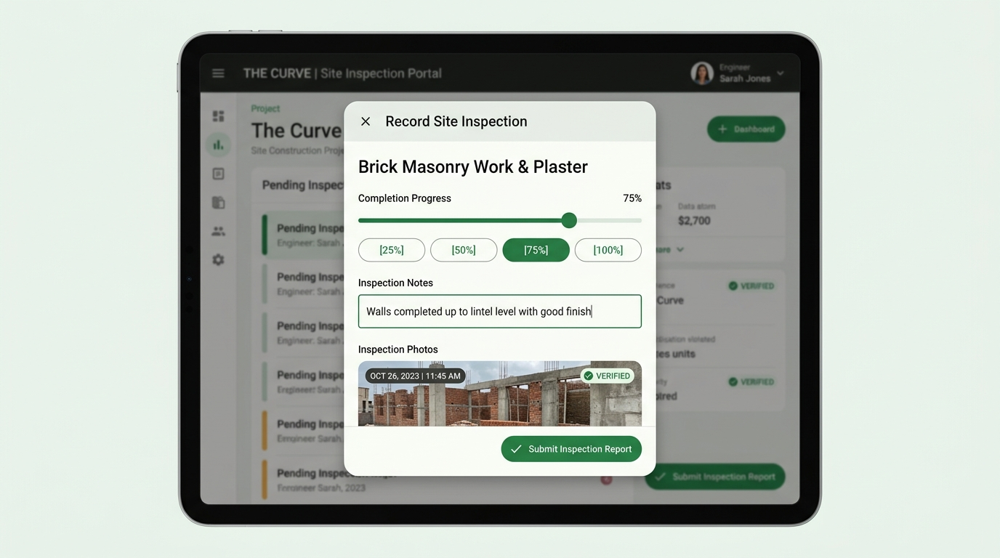

# The Curve — Real Estate Work Activities & Payment Management System
## Official User Operations Manual & System Guide (v2.0)

Welcome to **The Curve Work Activities App**, an enterprise-grade real estate construction project management and contractor payment disbursement platform. This manual covers operational workflows, role permissions, step-by-step instructions, and visual interface guides for all four system roles: **Administrators**, **Site Engineers**, **Trade Contractors**, and **Project Owners / Investors**.

---

## 📑 Table of Contents

1. [System Architecture & Structural Hierarchy](#1-system-architecture--structural-hierarchy)
2. [Navigation & Interface Overview](#2-navigation--interface-overview)
3. [Administrator Guide](#3-administrator-guide)
   - [3.1 Work Activities & Disbursement Console](#31-work-activities--disbursement-console)
   - [3.2 Project, Block & Unit Setup](#32-project-block--unit-setup)
   - [3.3 Team & Contractor Allocations](#33-team--contractor-allocations)
   - [3.4 User Accounts & Mobile Login Credentialing](#34-user-accounts--mobile-login-credentialing)
   - [3.5 Master Activity Catalog](#35-master-activity-catalog)
   - [3.6 Reports, Financial Analytics & Exports](#36-reports-financial-analytics--exports)
   - [3.7 Password-Protected Security & Audit Trail](#37-password-protected-security--audit-trail)
4. [Site Engineer / Supervisor Operational Guide](#4-site-engineer--supervisor-operational-guide)
   - [4.1 Unit Checklist & Task Supervision](#41-unit-checklist--task-supervision)
   - [4.2 3 Modes of Activity Provisioning](#42-3-modes-of-activity-provisioning)
   - [4.3 Conducting Inspections & Photo Verification](#43-conducting-inspections--photo-verification)
   - [4.4 Contractor Delegation](#44-contractor-delegation)
5. [Trade Contractor Portal Guide](#5-trade-contractor-portal-guide)
   - [5.1 Work Order Queue](#51-work-order-queue)
   - [5.2 Milestone Progress Tracking & Sign-off](#52-milestone-progress-tracking--sign-off)
   - [5.3 Disbursement History Ledger](#53-disbursement-history-ledger)
6. [Owner & Investor Portfolio Guide](#6-owner--investor-portfolio-guide)
   - [6.1 Executive Portfolio Overview](#61-executive-portfolio-overview)
   - [6.2 Financial Health & Disbursement Tracking](#62-financial-health--disbursement-tracking)
   - [6.3 Verified Photo Evidence Timeline](#63-verified-photo-evidence-timeline)
7. [Progressive Web App (PWA) Mobile Installation](#7-progressive-web-app-pwa-mobile-installation)

---

## 1. System Architecture & Structural Hierarchy

The system organizes real estate developments in a strict 4-tier relational hierarchy:

- **Project**: Represents a physical development site (e.g., *Skyline Heights*).
- **Block / Tower**: High-rise towers, wings, or structural phases within a project (e.g., *Tower A*, *Tower B*).
- **Unit / Flat**: Specific residential apartments or commercial units (e.g., *Flat 302*, 3 BHK, 1450 sq.ft).
- **Unit Activities**: Granular construction tasks attached to each unit (e.g., *RCC Framing*, *Internal Plaster*, *Electrical Conduits*, *Tile Flooring*).

---

## 2. Navigation & Interface Overview

The portal features a dual-navigation layout built for responsiveness across desktop and mobile devices:

- **Desktop Left Sidebar Navigation**:
  - `Dashboard`: Live Work Activities & Payment Console.
  - `Projects`: Development projects, towers, unit inventory, and team assignments.
  - `User Accounts`: Directory of system administrators, engineers, contractors, and owners.
  - `Activity`: Master template catalog for standardized construction milestones.
  - `Reports & Exports`: Financial summaries, contractor payment ledgers, CSV and PDF print downloads.
  - `Audit & Logs`: Immutable security logs of all system operations.
  - `User Manual`: Interactive visual guide with embedded UI screenshots.
- **Mobile Top Bar & Horizontal Scroll Navigation**: Provides fast access to all navigation sections on smartphones and tablets.

---

## 3. Administrator Guide

### 3.1 Work Activities & Disbursement Console

The **Admin Console** on the Dashboard provides real-time control over all unit construction tasks, contractor assignments, and milestone disbursements.

*Figure 1: Admin Work Activities & Payment Console with multi-unit filtering, progress %, contractor binding, and payment recording.*

#### Operational Steps:
1. **Select Scope**: Use the top dropdown selectors to choose the target **Project**, **Block/Tower**, and **Unit**.
2. **Review Checklist**: Inspect the status badge (`Pending`, `In Progress`, `Completed`), progress percentage bar, and assigned contractor agency.
3. **Assign Contractor**: If a task displays *(Not Assigned)*, click **`+ Assign Contractor`** to bind the trade company.
4. **Record Milestone Payment**: Click **`Record Payment`** on an active task row:
   - The dialog automatically locks to the selected activity and pre-selects the assigned contractor.
   - Enter the disbursement amount (blank by default).
   - Select Payment Mode (`NEFT/RTGS`, `UPI`, `Cheque`, `Cash`).
   - Add reference voucher notes and click **`Confirm Payment`**.

---

### 3.2 Project, Block & Unit Setup

Administrators create and manage the complete structural inventory of developments under `/admin/projects`.

*Figure 2: Project setup showing Tower/Block inventory and Team Allocation for Site Engineers and Contractors.*

1. **Create Project**: Click **`New Project`**, enter project name, location, and initial status.
2. **Add Blocks/Towers**: Open the project, click **`Add Block`**, name the tower (e.g. *Tower A*), and configure sort ordering.
3. **Add Units / Inventory**: Inside the block, click **`Add Unit`**, specify unit number (e.g. *302*), floor number, flat type (e.g. *3 BHK*), and area in sq.ft.

---

### 3.3 Team & Contractor Allocations

To ensure data isolation, users can only access projects they are explicitly allocated to.

1. Open the project in `/admin/projects/[id]`.
2. Navigate to the **Manage Team** panel.
3. Allocate **Site Engineers**, **Trade Contractors** (with company agency names like *Apex Electricals*), and **Project Owners**.

---

### 3.4 User Accounts & Mobile Login Credentialing

The system utilizes **10-digit Mobile Numbers** as primary login identifiers across all user roles.

- Navigate to `/admin/users` to view all active user accounts.
- Click **`Create User`**, enter Full Name, Mobile Number, assigned Role, and use the **`Generate Password`** tool.
- Administrators can perform **Instant Password Resets** directly without waiting for email verification tokens.
- **Account Deletions** strictly require typing the administrator password.

---

### 3.5 Master Activity Catalog

Under `/admin/activity-master`, administrators manage standardized construction phase templates:
- Activities include Foundation, RCC, Masonry, Plaster, Plumbing, Electrical, Flooring, and Painting.
- Templates configure trade codes, categories, and Units of Measurement (`Sq.Ft`, `R.Ft`, `Lump Sum`, `Nos`).
- **Independent Unit Records**: Modifications in the master catalog do not alter existing unit activity records, ensuring total historical stability.

---

### 3.6 Reports, Financial Analytics & Exports

The Reports module (`/admin/reports`) delivers financial ledgers and export tools.

*Figure 3: Reports and Exports dashboard with financial summary metrics, voucher ledger, and CSV/PDF export options.*

- **Financial Summary Cards**: Real-time aggregation of **Total Project Budget**, **Disbursed Funds**, and **Remaining Balance**.
- **Payment Ledger**: Detailed record of vouchers with voucher ID, payment date, contractor name, project, milestone description, amount, and payment mode.
- **Data Exports**:
  - **`Export CSV`**: Downloads raw spreadsheet data for analysis in Microsoft Excel or Google Sheets.
  - **`Download PDF Report`**: Generates clean, print-ready executive financial vouchers.

---

### 3.7 Password-Protected Security & Audit Trail

- **Password Protected Mutations**: Critical delete operations (deleting a project, block, unit, activity, payment, or user account) require typing the current administrator password before execution.
- **Audit Logs (`/admin/audit-logs`)**: Permanently logs every creation, update, deletion, payment, and credential reset with actor identity, timestamps, and payload diffs.

---

## 4. Site Engineer / Supervisor Operational Guide

Site Engineers manage field operations directly from the construction site on mobile devices and tablets.

*Figure 4: Site Engineer Inspection modal with interactive progress slider, milestone buttons, field notes, and camera verification.*

### 4.1 Unit Checklist & Task Supervision
- Sign in with registered 10-digit mobile number.
- Open assigned project and select any Unit to access its live checklist of civil, MEP, and finishing tasks.

### 4.2 3 Modes of Activity Provisioning
When provisioning tasks for a unit, click **`Provision Activities`** and choose from:
1. **Mode A (Single Custom Activity)**: Enter a custom task name, estimated cost, and floor-specific notes.
2. **Mode B (Batch Template Checklist)**: Check off multiple standard master activities and provision them in bulk.
3. **Mode C (Clone from Another Unit)**: Copy all tasks and cost rates from an already configured typical flat with a single click.

### 4.3 Conducting Inspections & Photo Verification
1. Click **`Record Inspection`** on the activity row.
2. Adjust the completion progress slider (0% to 100%) or tap quick milestone buttons (`25%`, `50%`, `75%`, `100%`).
3. Add on-site inspection observations in the notes field.
4. Upload live camera photos to document completed milestones with verified visual evidence.
5. Click **`Submit Inspection Report`**.

---

## 5. Trade Contractor Portal Guide

Trade Contractors (civil, electrical, plumbing, finishing) access a streamlined view of work assigned to their company.

### 5.1 Work Order Queue
- Sign in with mobile number to view work orders grouped by Project, Tower, and Unit.
- Review technical specifications, task scopes, and target completion dates.

### 5.2 Milestone Progress Tracking & Sign-off
- Monitor verified progress percentages updated by Site Engineers.
- Coordinate on-site inspections upon milestone completion to obtain official engineer sign-off.

### 5.3 Disbursement History Ledger
- Track disbursed payments, reference voucher numbers, and pending balance dues per unit task.

---

## 6. Owner & Investor Portfolio Guide

Project Owners and Investors receive executive transparency into construction milestones and financial health.

### 6.1 Executive Portfolio Overview
- Aggregated real-time completion percentage across all projects, towers, and units.

### 6.2 Financial Health & Disbursement Tracking
- Real-time balances:
  - **Total Estimated Budget**
  - **Total Disbursed Funds**
  - **Remaining Balance Due**

### 6.3 Verified Photo Evidence Timeline
- Browse high-resolution, timestamped site photos uploaded directly by field engineers during milestone inspections.

---

## 7. Progressive Web App (PWA) Mobile Installation

The Curve is a certified Progressive Web App (PWA) that installs as a native mobile application on Android, iOS, and Desktop.

- **Desktop (Chrome/Edge)**: Click the **`Install App`** button in the sidebar or the install icon in the browser address bar.
- **Android**: Tap the **`Install App`** button or choose *“Add to Home Screen”* in Chrome.
- **iOS (Safari)**: Tap the *Share* button in Safari and select *“Add to Home Screen”*.

---

*The Curve Real Estate Work Activities & Payment Management System — Version 2.0*
